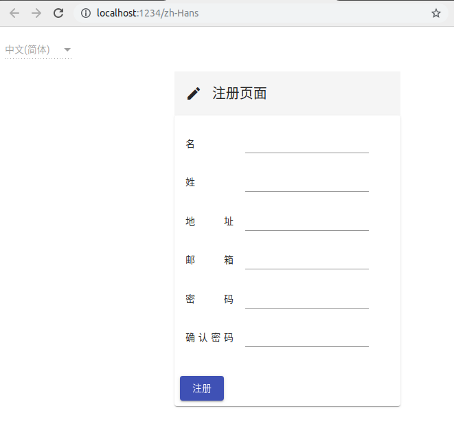
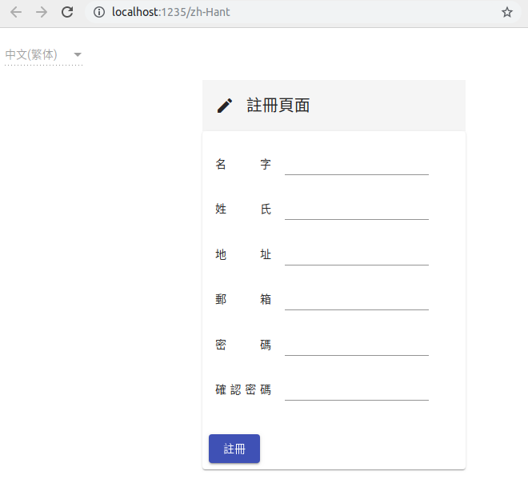
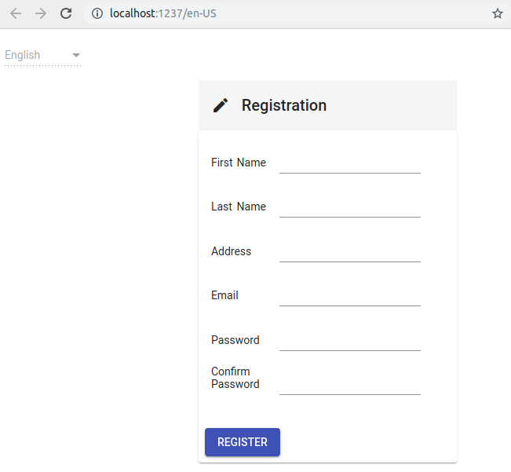
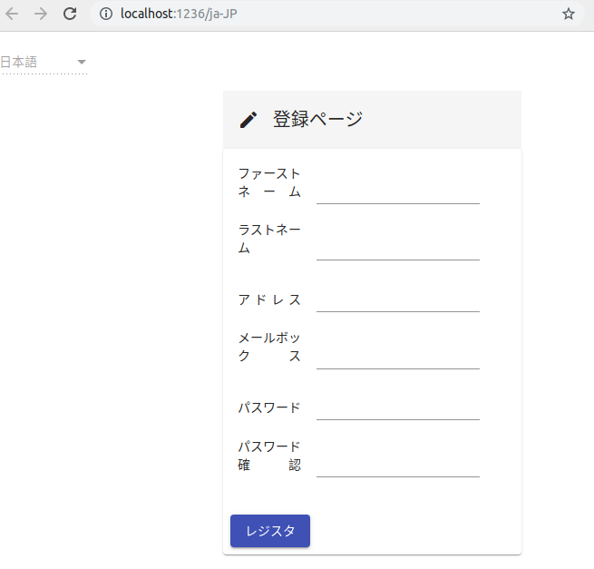

# AngularI18nDemo

这是一个 angular i18n 的示例项目，画面为一个常见的注册页面。

## 使用测试

- 运行`npm run zh-Hans`,浏览器打开显示中文简体的注册页面；
- 运行`npm run zh-Han`,浏览器打开显示中文繁体的注册页面；
- 运行`npm run en-US`,浏览器打开显示英语的注册页面；
- 运行`npm run ja-JP`,浏览器打开显示日语(百度翻译所得)的注册页面；
- 运行`npm build`,在 dist 得到 4 份不同语言的编译后文件夹；

`ng serve`默认显示英语的注册页面。

## 多国语言效果

中文简体版本：

中文繁体版本：

美国英语版本：

百度翻译日文版本：

